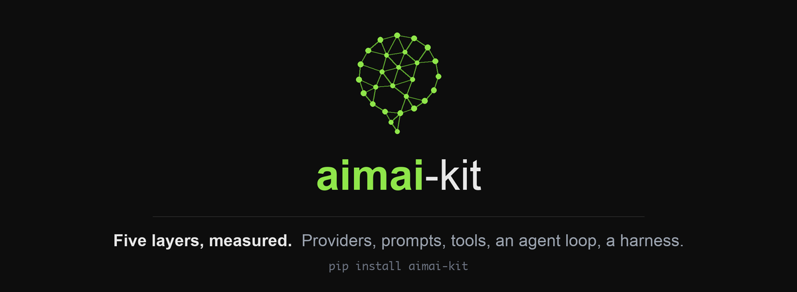

---
hide:
  - navigation
---

<div class="aimai-hero" markdown>

</div>

<div class="aimai-badges" markdown>
[](https://pypi.org/project/aimai-kit/)
[](https://pypi.org/project/aimai-kit/)
[](https://github.com/fport/aimai-kit/actions/workflows/ci.yml)
[](https://github.com/fport/aimai-kit/blob/main/LICENSE)
</div>

# Bu nedir

Framework kullanmadan yazılmış beş katmanlık bir LLM altyapısı. Her katman bir
öncekinin üstüne oturuyor ve her birinin kendi ölçümü var.

```bash
pip install "aimai-kit[providers]"
```

Bu paketin iddiası "framework'lerin yapamadığı bir şeyi yapıyor" değil.
İddia şu: içindeki her karar, hangi hatayı önlediğiyle birlikte yazılı, ve
paket hakkındaki her cümlenin arkasında API anahtarı olmadan tekrar
üretebileceğin bir sayı var.

!!! note "Kod İngilizce, anlatım Türkçe"

    Tip, alan ve fonksiyon adları İngilizce — paket uluslararası yayınlanıyor
    ve karışık dilli identifier okuyucuyu yavaşlatıyor. Bu site iki dilli;
    sağ üstteki seçiciden İngilizcesine geçebilirsin.

    Teknik terimler de İngilizce kalıyor: *provider*, *stub*, *executor*,
    *wrapper*, *extraction*, *summarizer*, *golden set*. Türkçeleştirilmiş
    hâlleri ("kukla", "sarmalayıcı", "çalıştırıcı") kimsenin konuşurken
    kullanmadığı, okurken durdurup düşündüren kelimeler.

---

## Beş katman

<div class="grid cards" markdown>

-   **[1. Provider](01-provider.md)**

    Tek bir iç mesaj formatı, beş hata sınıfı, dört adaptör. Retry kararı hata
    *sınıfına* bakar, mesaj metnine değil.

    *Kapattığı tuzak:* Anthropic cache'lenmiş token'ları `input_tokens`'ın
    dışında raporluyor. Bunu kaçırırsan her Anthropic maliyeti sessizce düşük
    çıkar.

-   **[2. Prompt ve context](02-prompts.md)**

    Sürümlü prompt dosyaları, gerçek bir context bütçesi, sınırlı onarım
    döngüsüyle yapılandırılmış çıktı ve alıntı doğrulaması.

    *Kapattığı tuzak:* belgeyi sistem prompt'una koymak cache'i her istekte
    geçersiz kılar. Hiçbir şey bozulmaz — sadece fatura katlanır.

-   **[3. Tool'lar](03-tools.md)**

    Fonksiyon imzasından türetilen şemalar, üç provider için dışa aktarım ve
    önünde beş kapı olan bir executor.

    *Kapattığı tuzak:* kiracı kimliğini şemaya koymak, modelin başka bir
    kiracı olduğunu iddia edebilmesi demek.

-   **[4. Ajan döngüsü](04-agent.md)**

    Dört bütçe, tek bir durma sebebi, kademeli döngü tespiti ve `to_dict` /
    `from_dict`'ten ibaret checkpoint'ler.

    *Kapattığı tuzak:* üç tool çağrısı yapıp iki sonuç dönen bir asistan turu,
    çoğu provider'ın reddettiği bir konuşma şeklidir.

-   **[5. Harness](05-harness.md)**

    Segmentler, spill, eşik tetiklemeli compaction, deterministik yazma kapılı
    bir bellek deposu ve alt-ajanlar.

    *Kapattığı tuzak:* ortadan kırpmak, kesim noktasından sonraki bütün
    cache'lenmiş token'ları geçersiz kılar. 2.000 token'lık tasarruf 40.000'e
    mal olabilir.

</div>

---

## Altmış saniye

=== "Ölçülen bir çağrı"

    ```python
    from aimai_kit.provider.adapters import make_adapter
    from aimai_kit.provider.types import ChatRequest, Message, Role

    client = make_adapter("anthropic:claude-opus-5")
    result = client.complete(
        ChatRequest(
            messages=[Message(role=Role.USER, content="Merhaba de.")],
            system="Kısa cevap ver.",
            max_output_tokens=64,
        )
    )
    print(result.text)
    # cached_input_tokens her zaman input_tokens'ın alt kümesi — provider
    # farkı adaptörde normalize edildi.
    print(result.usage.input_tokens, result.usage.cached_input_tokens)
    ```

=== "Uyduramayan extraction"

    ```python
    from aimai_kit.prompts import PromptRegistry, build_request, generate_structured
    from aimai_kit.prompts.grounding import verify_citations
    from aimai_kit.prompts.schemas import ContractSummary

    built = build_request(
        PromptRegistry("prompts"),
        "extract_contract@v2",
        document,
        schema=ContractSummary,
    )
    repaired = generate_structured(client, built.req, ContractSummary)
    summary, grounding = verify_citations(repaired.value, document)

    # Alıntısı belgede bulunamayan her alan None'a düşürüldü.
    print(summary.amount_minor, grounding.ratio, grounding.dropped)
    ```

=== "Bütçeli bir ajan"

    ```python
    from aimai_kit.agent import Agent, Budgets, Thread
    from aimai_kit.tools import CallContext, ToolExecutor
    from aimai_kit.tools.examples.orders import build_registry, seed_database

    seed_database()
    agent = Agent(
        client,
        ToolExecutor(build_registry()),
        budgets=Budgets(max_steps=8, max_seconds=60),
    )
    run = agent.run(
        Thread(),
        "1002 numaralı siparişin durumu ne?",
        ctx=CallContext(user_id="u-1", tenant_id="t-1"),
    )
    print(run.stop_reason, run.answer)
    ```

---

## Sayılar ne diyor

Her rakam, depodan kimlik bilgisi olmadan tekrar üretilebilir. Tam tablolar ve
uyarıları **[Ölçümler](measurements.md)** sayfasında.

| Deney | Bulgu |
|---|---|
| Şema v1 → v2 | Grounding %0 → %100; belge başına 0,11 fazladan deneme ve %11 daha yüksek maliyet karşılığında |
| Grounding ayrıştırması | v1'in `start_date` alanı grounding açıkken %0, kapalıyken %88,9 okunuyor |
| Tool açıklamaları | Açıklamayı tek cümleye indirmek seçim doğruluğunu değiştirmiyor ama yasak tool çağrısını %0'dan %4,5'e çıkarıyor |
| Döngü tespiti | p95 adım 7 → 3; karşılığında tamamlanma %100 → %75 |
| Harness konfigürasyonları | Naif kırpma 101k token ve cevap yok; compaction + alt-ajan 12k token ve cevap yerinde |

!!! warning "Bu sayıların arkasındaki modeller stub"

    Provider değil. Gerçek iş yapıyorlar — extraction stub'ı sözleşmeleri
    regex'le ayrıştırıyor, seçim stub'ı sorguları tool açıklamalarına göre
    puanlıyor, harness stub'ı yalnızca context'inde olandan cevap veriyor —
    ama sentetik verinin şeklini bildikleri için doğrulukları iyimser.

    Bu bilinçli. Bu tablolar ölçüm altyapısının çalıştığını ve
    karşılaştırmaların tekrar üretilebildiğini gösteriyor. Model hakkında sayı
    istiyorsan aynı komutları `--model anthropic:claude-opus-5` ile koştur.

---

## Proda çıkmadan

Beş bölüm her katmanın neden öyle göründüğünü anlatıyor.
**[Proda çıkmadan checklist](checklist.md)** ise bunu bir sürüm öncesi gözden
geçirebileceğin bir şeye çeviriyor: bir provider bağlarken, bir prompt yazarken, bir
tool eklerken, bir budget ayarlarken ve iş uzadığında neye bakacaksın — her madde,
bölümlerden birinin düzeltmek zorunda kaldığı bir arızaya dayanıyor.
